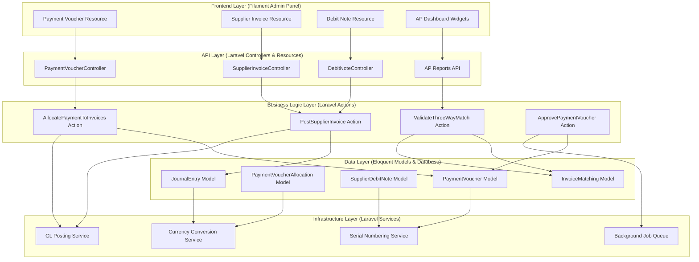
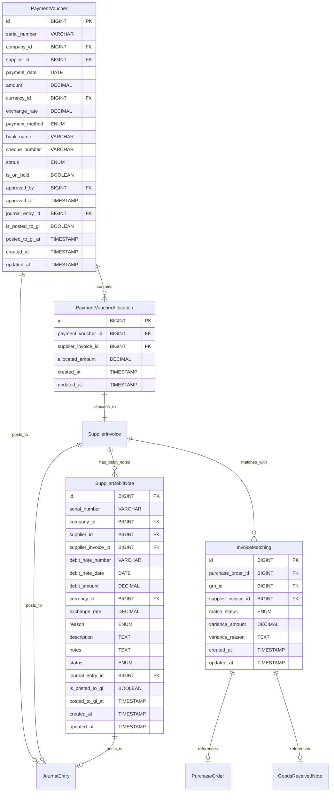
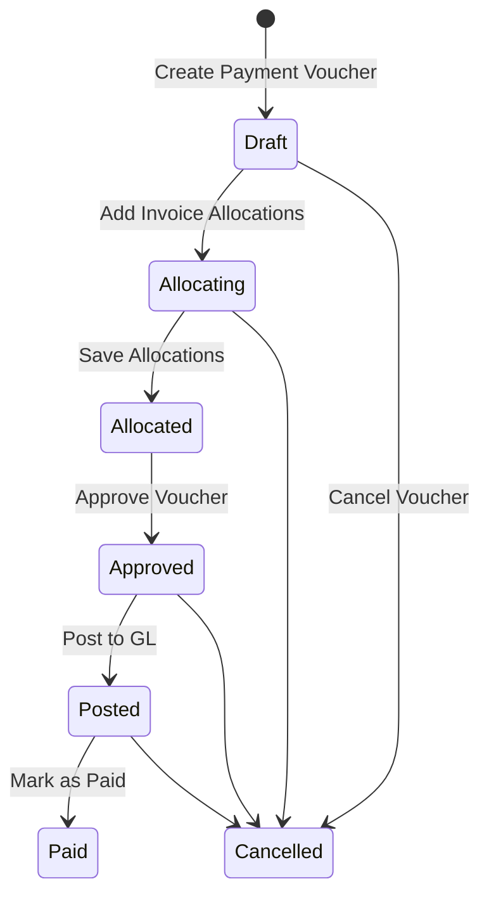

# Implement Accounts Payable (AP) Module Foundation


## Goal

The Accounts Payable (AP) Module Foundation aims to establish a robust system for managing supplier invoices, payment vouchers, debit notes, and general ledger integration within the NexusErp application. This foundation will enable efficient tracking of supplier payments, automate payment allocation processes, and ensure accurate financial reporting through seamless GL integration. By implementing three-way matching validation and comprehensive approval workflows, the system will reduce payment errors and improve cash flow management. The module will mirror the existing AR module structure while focusing on outbound payments to suppliers, providing a complete payables management solution.

## Requirements

### Functional Requirements
- **REQ-001**: Integrate with Purchase Module's SupplierInvoice model for payment tracking
- **REQ-002**: Implement payment voucher system with AP- prefix serial numbering and batch processing capabilities
- **REQ-003**: Support supplier debit notes with DN- prefix for purchase returns and adjustments
- **REQ-004**: Implement three-way matching (PO-GRN-Invoice) validation for invoice approval
- **REQ-005**: Support payment terms, due date calculation, and payment hold workflows
- **REQ-006**: Enable GL integration with double-entry bookkeeping for all AP transactions
- **REQ-007**: Provide comprehensive audit trails for all payment and approval activities

### Technical Requirements
- **REQ-008**: Must reuse existing SupplierInvoice model from Purchase Module
- **REQ-009**: Must implement HasSerialNumbering trait for transactional models
- **REQ-010**: Must use BCMath for precise financial calculations
- **REQ-011**: Must follow spatie/laravel-model-status for workflow management
- **REQ-012**: Must integrate with existing JournalEntry and Account models

### Integration Requirements
- **REQ-013**: Link to PurchaseOrder model for three-way matching validation
- **REQ-014**: Connect with GRN (Goods Received Note) model when available
- **REQ-015**: Integrate with GL Account model for expense and AP account management
- **REQ-016**: Support currency conversion and exchange rate handling

### Security Requirements
- **REQ-017**: Implement payment approval workflow with role-based authorization
- **REQ-018**: Require specific permissions for payment holds and GL posting
- **REQ-019**: Maintain audit trail of all approvers and posting activities
- **REQ-020**: Ensure data validation and sanitization for all financial inputs

## Technical Considerations

### System Architecture Overview



**Technology Stack Selection:**
- **Frontend Layer**: FilamentPHP v4.1 for admin panel with Laravel Blade templates
- **API Layer**: Laravel controllers with resource classes for RESTful endpoints
- **Business Logic Layer**: Laravel Actions (lorisleiva/laravel-actions) for granular, testable business logic
- **Data Layer**: Eloquent ORM with MySQL database, Redis for caching
- **Infrastructure Layer**: Laravel services with database transactions and queue system

**Integration Points:**
- Purchase Module: SupplierInvoice model integration
- GL Module: JournalEntry posting and Account model relationships
- Currency Module: Exchange rate handling via ariaieboy/filament-currency
- Status Management: spatie/laravel-model-status for workflow states

**Deployment Architecture:**
- Docker containerization for consistent environments
- Background job processing via Laravel Queue
- Database migrations for schema versioning
- Environment-based configuration management

**Scalability Considerations:**
- Horizontal scaling through load balancers for multiple app instances
- Database read replicas for reporting queries
- Redis caching for frequently accessed financial data
- Queue-based processing for bulk payment operations

### Database Schema Design



**Table Specifications:**
- All monetary fields use DECIMAL(15,4) for precision
- Serial numbers use VARCHAR with unique constraints
- Status enums use predefined values with defaults
- Foreign keys include cascade delete where appropriate
- Timestamps include timezone handling

**Indexing Strategy:**
- Composite indexes on (company_id, status) for filtering
- Unique indexes on serial numbers and allocation pairs
- Foreign key indexes for join performance
- Partial indexes on active records (is_posted_to_gl = false)

**Foreign Key Relationships:**
- Company-scoped relationships for multi-tenancy
- Soft deletes for audit trail preservation
- Polymorphic relationships for flexible GL integration

**Database Migration Strategy:**
- Version-controlled migrations in timestamped files
- Rollback support for safe deployments
- Data seeding for initial AP account setup
- Migration testing in CI/CD pipeline

### API Design

**Endpoints:**

- `GET /api/payment-vouchers` - List payment vouchers with filtering
- `POST /api/payment-vouchers` - Create new payment voucher
- `GET /api/payment-vouchers/{id}` - Get payment voucher details
- `PUT /api/payment-vouchers/{id}` - Update payment voucher
- `POST /api/payment-vouchers/{id}/allocate` - Allocate payment to invoices
- `POST /api/payment-vouchers/{id}/approve` - Approve payment voucher
- `POST /api/supplier-invoices/{id}/post-to-gl` - Post invoice to GL
- `GET /api/ap-reports/outstanding` - Get outstanding payables report

**Request/Response Formats:**

```typescript
interface PaymentVoucherRequest {
  supplier_id: number;
  payment_date: string;
  amount: number;
  currency_id: number;
  payment_method: 'cash' | 'cheque' | 'bank_transfer' | 'wire';
  allocations: Array<{
    supplier_invoice_id: number;
    allocated_amount: number;
  }>;
}

interface PaymentVoucherResponse {
  id: number;
  serial_number: string;
  supplier: Supplier;
  payment_date: string;
  amount: number;
  currency: Currency;
  status: 'draft' | 'approved' | 'paid' | 'cancelled';
  allocations: PaymentAllocation[];
  created_at: string;
  updated_at: string;
}
```

**Authentication and Authorization:**
- Laravel Sanctum for API token authentication
- Role-based permissions (payment.create, payment.approve, gl.post)
- Company-scoped data access
- Audit logging for all API operations

**Error Handling:**
- HTTP status codes (400 for validation, 403 for unauthorized, 404 for not found)
- Structured error responses with error codes and messages
- Validation error details for form corrections
- Rate limiting with 429 responses

**Rate Limiting and Caching:**
- API rate limiting: 100 requests/minute per user
- Response caching for read-only endpoints (5 minutes)
- Database query result caching for reports
- Redis-based session storage

### Frontend Architecture

#### Component Hierarchy Documentation

The AP module leverages FilamentPHP v4.1 for consistent admin interface components.

**Payment Voucher Management Page Layout:**

```
AP Module Navigation
├── Payment Vouchers Resource
│   ├── List Table (Filament Table)
│   │   ├── Serial Number Column
│   │   ├── Supplier Name Column (relationship)
│   │   ├── Payment Date Column
│   │   ├── Amount Column (currency formatted)
│   │   ├── Status Badge Column
│   │   └── Actions (View, Edit, Allocate)
│   ├── Create Form (Filament Form)
│   │   ├── Supplier Select (relationship)
│   │   ├── Payment Date Picker
│   │   ├── Amount Input (currency)
│   │   ├── Payment Method Select
│   │   ├── Bank Details Section (conditional)
│   │   └── Allocation Repeater
│   └── Edit Form (similar to create)
├── Supplier Invoices Resource
│   ├── List Table with payment status
│   ├── Invoice Details View
│   └── Payment History Tab
└── Debit Notes Resource
    ├── List Table
    ├── Create Form with reason selection
    └── Application Form (link to invoice)
```

**State Flow Diagram:**



**Reusable Component Library:**
- CurrencyInput component for monetary values
- StatusBadge component for workflow states
- AllocationTable component for payment distributions
- AuditTrail component for change history

**State Management Patterns:**
- Filament's built-in form state management
- Livewire for reactive components
- Session storage for form drafts
- Database persistence for workflow states

**TypeScript Interfaces:**

```typescript
interface PaymentVoucher {
  id: number;
  serial_number: string;
  supplier_id: number;
  payment_date: string;
  amount: number;
  currency_id: number;
  status: PaymentStatus;
  allocations: PaymentAllocation[];
}

interface PaymentAllocation {
  supplier_invoice_id: number;
  allocated_amount: number;
  invoice: SupplierInvoice;
}

type PaymentStatus = 'draft' | 'approved' | 'paid' | 'cancelled';
```

### Security Performance

**Authentication/Authorization Requirements:**
- Multi-factor authentication for payment approvals
- Role-based access control (RBAC) with granular permissions
- Company data isolation for multi-tenant security
- Session timeout and secure logout mechanisms

**Data Validation and Sanitization:**
- Server-side validation for all financial inputs
- XSS protection for user-generated content
- SQL injection prevention via Eloquent ORM
- File upload validation for payment attachments

**Performance Optimization Strategies:**
- Database query optimization with eager loading
- Redis caching for frequently accessed data
- Background job processing for GL posting
- Database indexing on critical query paths

**Caching Mechanisms:**
- Application-level caching for configuration data
- Database query result caching for reports
- Page-level caching for static content
- CDN integration for asset delivery