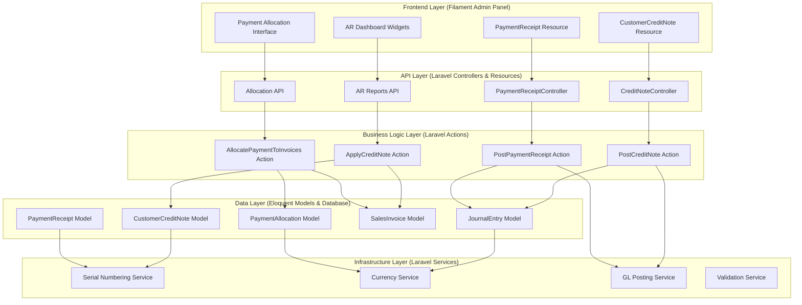
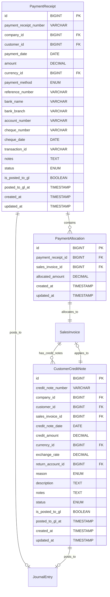
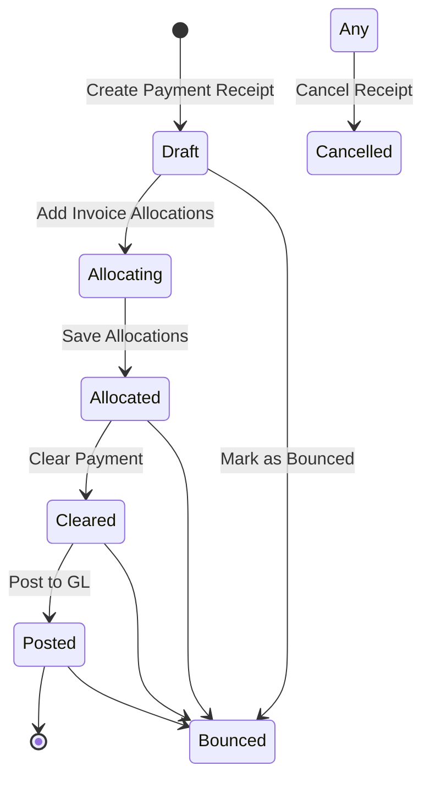

# Complete Accounts Receivable Module Filament Resources

## Goal

The AR Filament Resources completion aims to provide comprehensive user interfaces for managing customer payments and credit notes within the NexusErp accounting system. This feature will implement PaymentReceipt and CustomerCreditNote Filament resources with advanced payment allocation capabilities, GL integration, and workflow management. By creating intuitive forms and tables that follow Filament v4.2 patterns, the system will enable efficient accounts receivable operations while maintaining data integrity and audit trails. The implementation will support both manual and automatic payment allocations, ensuring accurate tracking of customer payments against outstanding invoices.

## Requirements

### Functional Requirements
- **REQ-001**: PaymentReceiptResource must support all payment methods (cash, bank, card, cheque, online, other) with method-specific fields
- **REQ-002**: Implement payment allocation interface with manual and automatic FIFO allocation to invoices
- **REQ-003**: CustomerCreditNoteResource must support reason tracking, optional invoice linkage, and GL posting
- **REQ-004**: Both resources must integrate with GL posting actions and maintain audit trails
- **REQ-005**: Resources must follow Filament v4.2 compatibility patterns with proper form schemas
- **REQ-006**: Status workflows must enforce business rules (draft → cleared/bounced/cancelled for payments)
- **REQ-007**: Currency handling with proper formatting and exchange rate support

### UI/UX Requirements
- **UX-001**: Forms must display meaningful relationship data (customer names, invoice numbers) instead of raw IDs
- **UX-002**: Status badges with consistent color coding (draft=gray, cleared=success, bounced=danger, cancelled=warning)
- **UX-003**: Clear validation messages and actionable error states
- **UX-004**: Currency amounts displayed with proper formatting and precision
- **UX-005**: Conditional field visibility based on payment methods and status
- **UX-006**: Inline allocation interface with real-time calculation updates

### Technical Requirements
- **REQ-008**: Must use Filament v4.2+ form schema pattern: `form(Schema $schema): Schema`
- **REQ-009**: Component imports must use correct namespaces (Forms\Components vs Components)
- **REQ-010**: Must follow PSR-12 coding standards with return type declarations
- **REQ-011**: Database transactions for allocation and GL posting operations
- **REQ-012**: Proper relationship loading and query optimization

### Security Requirements
- **SEC-001**: Role-based authorization for GL posting operations
- **SEC-002**: Automatic population of audit fields (created_by, updated_by)
- **SEC-003**: Financial data validation and sanitization before persistence
- **SEC-004**: Prevention of over-allocation and invalid status transitions

### Integration Requirements
- **INT-001**: Resources must call PostPaymentReceipt and PostCreditNote actions for GL integration
- **INT-002**: Payment allocation must atomically update invoice outstanding amounts
- **INT-003**: Status transitions must follow defined workflows with validation
- **INT-004**: Integration with SalesInvoice model for payment status updates

## Technical Considerations

### System Architecture Overview



**Technology Stack Selection:**
- **Frontend Layer**: FilamentPHP v4.2 for admin panel with consistent form schemas and table displays
- **API Layer**: Laravel resource controllers with RESTful endpoints for AJAX operations
- **Business Logic Layer**: Laravel Actions for reusable, testable payment processing logic
- **Data Layer**: Eloquent ORM with MySQL, Redis for caching payment allocation data
- **Infrastructure Layer**: Laravel services with database transactions and background job queues

**Integration Points:**
- Sales Module: SalesInvoice model integration for payment allocation
- GL Module: JournalEntry posting and Account model relationships
- Currency Module: Exchange rate handling via ariaieboy/filament-currency
- Status Management: spatie/laravel-model-status for workflow states

**Deployment Architecture:**
- Docker containerization for consistent Filament environments
- Background job processing for bulk payment allocations
- Database migrations for schema versioning
- Environment-based configuration for payment method settings

**Scalability Considerations:**
- Horizontal scaling through load balancers for multiple admin panel instances
- Database read replicas for AR reporting queries
- Redis caching for payment allocation calculations
- Queue-based processing for GL posting operations

### Database Schema Design



**Table Specifications:**
- All monetary fields use DECIMAL(15,4) for precision
- Serial numbers use VARCHAR with unique constraints per company
- Status enums use predefined values with database check constraints
- Foreign keys include cascade delete where appropriate for data integrity
- Timestamps include timezone handling for audit trails

**Indexing Strategy:**
- Composite indexes on (company_id, status) for filtering active records
- Unique indexes on payment_receipt_number and credit_note_number
- Foreign key indexes for join performance in allocation queries
- Partial indexes on unposted records (is_posted_to_gl = false)

**Foreign Key Relationships:**
- Company-scoped relationships for multi-tenancy support
- Soft deletes for audit trail preservation in financial records
- Polymorphic relationships for flexible GL account integration

**Database Migration Strategy:**
- Version-controlled migrations in timestamped files
- Rollback support for safe production deployments
- Data seeding for initial payment method configurations
- Migration testing in CI/CD pipeline with financial data validation

### API Design

**Endpoints:**

- `GET /api/payment-receipts` - List payment receipts with filtering and pagination
- `POST /api/payment-receipts` - Create new payment receipt
- `GET /api/payment-receipts/{id}` - Get payment receipt details with allocations
- `PUT /api/payment-receipts/{id}` - Update payment receipt
- `POST /api/payment-receipts/{id}/allocate` - Allocate payment to invoices
- `POST /api/payment-receipts/{id}/post-to-gl` - Post payment to GL
- `GET /api/customer-credit-notes` - List credit notes with filtering
- `POST /api/customer-credit-notes` - Create new credit note
- `POST /api/customer-credit-notes/{id}/apply` - Apply credit note to invoice
- `POST /api/customer-credit-notes/{id}/post-to-gl` - Post credit note to GL

**Request/Response Formats:**

```typescript
interface PaymentReceiptRequest {
  customer_id: number;
  payment_date: string;
  amount: number;
  currency_id: number;
  payment_method: 'cash' | 'bank_transfer' | 'credit_card' | 'debit_card' | 'cheque' | 'online' | 'other';
  reference_number?: string;
  bank_details?: {
    bank_name: string;
    bank_branch: string;
    account_number: string;
  };
  cheque_details?: {
    cheque_number: string;
    cheque_date: string;
  };
  transaction_id?: string;
  notes?: string;
  allocations?: Array<{
    sales_invoice_id: number;
    allocated_amount: number;
  }>;
}

interface PaymentReceiptResponse {
  id: number;
  payment_receipt_number: string;
  customer: Customer;
  payment_date: string;
  amount: number;
  currency: Currency;
  payment_method: string;
  status: PaymentStatus;
  allocations: PaymentAllocation[];
  is_posted_to_gl: boolean;
  created_at: string;
  updated_at: string;
}
```

**Authentication and Authorization:**
- Laravel Sanctum for API token authentication in admin panel
- Role-based permissions (payment.create, payment.post_to_gl, credit_note.create)
- Company-scoped data access for multi-tenant security
- Audit logging for all financial operations

**Error Handling:**
- HTTP status codes (400 for validation, 403 for unauthorized, 409 for business rule violations)
- Structured error responses with error codes and field-specific messages
- Validation error details for form correction
- Business rule violation messages (e.g., "Cannot allocate more than payment amount")

**Rate Limiting and Caching:**
- API rate limiting: 200 requests/minute per admin user
- Response caching for read-only endpoints (10 minutes)
- Database query result caching for allocation calculations
- Redis-based session storage for form state

### Frontend Architecture

#### Component Hierarchy Documentation

The AR resources leverage FilamentPHP v4.2 for consistent admin interface components.

**Payment Receipt Management Page Layout:**

```
AR Module Navigation
├── Payment Receipts Resource
│   ├── List Table (Filament Table)
│   │   ├── Payment Receipt Number Column
│   │   ├── Customer Name Column (relationship)
│   │   ├── Payment Date Column
│   │   ├── Amount Column (currency formatted)
│   │   ├── Payment Method Badge Column
│   │   ├── Status Badge Column
│   │   ├── Allocated/Unallocated Columns
│   │   └── Actions (View, Edit, Allocate, Post to GL)
│   ├── Create Form (Filament Form)
│   │   ├── Customer Select (relationship)
│   │   ├── Payment Date Picker
│   │   ├── Amount Input (currency)
│   │   ├── Payment Method Select
│   │   ├── Method-Specific Fields Section (conditional)
│   │   ├── Reference Fields
│   │   └── Allocation Repeater
│   └── Edit Form (similar to create)
├── Credit Notes Resource
│   ├── List Table with credit details
│   ├── Create Form with reason selection
│   ├── Invoice Application Interface
│   └── GL Posting Actions
└── AR Reports Section
    ├── Outstanding Receivables Report
    ├── Payment History Report
    └── Aging Analysis Report
```

**State Flow Diagram:**



**Reusable Component Library:**
- CurrencyInput component for monetary values with validation
- PaymentMethodFields component for conditional method-specific inputs
- AllocationRepeater component for invoice payment distribution
- StatusBadge component for workflow state visualization
- AuditTrail component for change history display

**State Management Patterns:**
- Filament's built-in form state management with reactive validation
- Livewire for dynamic field visibility based on payment methods
- Session storage for draft form preservation
- Database persistence for allocation and status changes

**TypeScript Interfaces:**

```typescript
interface PaymentReceipt {
  id: number;
  payment_receipt_number: string;
  customer_id: number;
  payment_date: string;
  amount: number;
  currency_id: number;
  payment_method: PaymentMethod;
  status: PaymentStatus;
  allocations: PaymentAllocation[];
  is_posted_to_gl: boolean;
}

interface PaymentAllocation {
  sales_invoice_id: number;
  allocated_amount: number;
  invoice: SalesInvoice;
}

interface CustomerCreditNote {
  id: number;
  credit_note_number: string;
  customer_id: number;
  sales_invoice_id?: number;
  credit_amount: number;
  currency_id: number;
  reason: CreditNoteReason;
  status: CreditNoteStatus;
  is_posted_to_gl: boolean;
}

type PaymentMethod = 'cash' | 'bank_transfer' | 'credit_card' | 'debit_card' | 'cheque' | 'online' | 'other';
type PaymentStatus = 'draft' | 'cleared' | 'bounced' | 'cancelled';
type CreditNoteReason = 'return' | 'price_adjustment' | 'discount' | 'error_correction' | 'service_issue' | 'other';
type CreditNoteStatus = 'draft' | 'issued' | 'applied' | 'cancelled';
```

### Security Performance

**Authentication/Authorization Requirements:**
- Multi-factor authentication for payment posting operations
- Role-based access control (RBAC) with granular permissions for AR operations
- Company data isolation for secure multi-tenant operations
- Session timeout and secure logout mechanisms

**Data Validation and Sanitization:**
- Server-side validation for all financial inputs and allocations
- XSS protection for user-generated content in notes and descriptions
- SQL injection prevention via Eloquent ORM parameter binding
- Business rule validation (allocation limits, status transitions)

**Performance Optimization Strategies:**
- Database query optimization with eager loading for relationship data
- Redis caching for frequently accessed customer and invoice data
- Background job processing for bulk GL posting operations
- Database indexing on critical query paths (company_id, status, dates)

**Caching Mechanisms:**
- Application-level caching for configuration data (payment methods, reasons)
- Database query result caching for allocation calculations
- Page-level caching for static AR report data
- CDN integration for asset delivery in admin panel